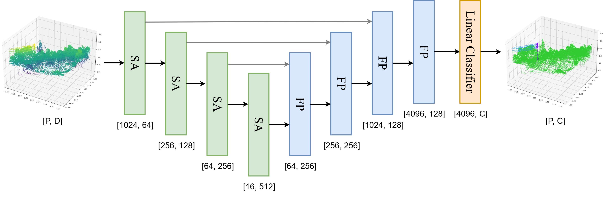
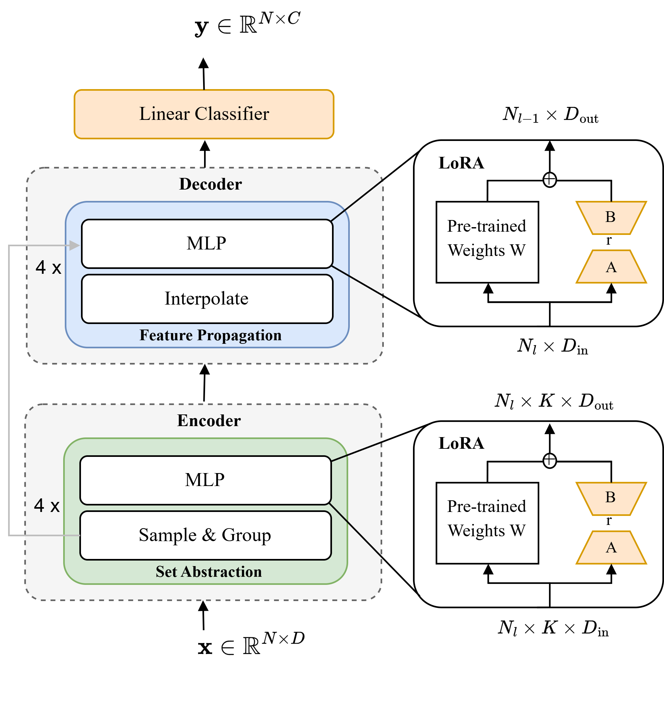

# LoRA for PointNet++ in Airborne LiDAR Semantic Segmentation

> Parameter‑efficient fine‑tuning (LoRA) for 3D point cloud semantic segmentation with PointNet++, evaluated on airborne LiDAR datasets.

[](#license)
[]()
[]()

## 💡 Overview
This repository contains code and assets accompanying the paper:
> **Efficient Task and Domain Adaptation in ALS Semantic Segmentation via LoRA for PointNet++**  
Semantic segmentation of airborne LiDAR point clouds enables a broad range of urban and environmental applications. However, domain shifts between training and operational data, as well as the frequent emergence of new semantic classes, pose significant challenges for deploying deep learning models effectively. In this work, we explore the integration of Low-Rank Adaptation (LoRA), a parameter-efficient fine-tuning technique, into the PointNet++ architecture to address these challenges. We evaluate LoRA in two realistic scenarios: domain adaptation and incremental learning with novel classes, using large-scale LiDAR datasets. Our experiments demonstrate that LoRA achieves superior performance compared to traditional full fine-tuning, showing greater resistance to catastrophic forgetting and improved generalization, particularly for underrepresented classes. Furthermore, LoRA maintains or exceeds baseline accuracy with substantially fewer trainable parameters, highlighting its suitability for resource-constrained deployment scenarios. We also present TerLiDAR, a publicly available annotated airborne LiDAR dataset, to support further research in domain adaptation for remote sensing.

<p align="center">
  
</p>

### LoRA applied to PointNet++:
>LoRA applied to PointNet++. Orange boxes indicate trainable modules. The input point cloud is represented as \( \mathbf{x} \in \mathbb{R}^{N \times D} \), where \( N \) is the number of input points and \( D \) is the number of input features.  Each layer processes local neighborhoods, where \( N_l \) is the number of sampled points at each level \( l \), \( K \)  the number of neighboring points in the local region and \( D_{\text{in}} \) and \( D_{\text{out}} \) are the input and output feature dimensions, respectively. The output of the network is a per-point semantic prediction \( \mathbf{y} \in \mathbb{R}^{N \times C} \), where \( C \) is the number of semantic classes.

<p align="center">
  
</p>

## ✨ Key Contributions
- **LoRA-enabled PointNet++**: Drop‑in adapters on SA/FP layers for efficient fine‑tuning.
- **Task & domain adaptation**: Experiments on cross‑area ALS data and class extension (e.g., Buildings, Vehicles).
- **Memory efficiency**: Train only low‑rank adapters while freezing the backbone for faster iteration and lower VRAM usage.

## 📦 Environment
- Python 3.9+
- PyTorch 1.12+ with CUDA 11.x (recommended)
- Common libs: numpy, scipy, matplotlib, tqdm, hydra, wandb (optional)

Quick setup:
```bash
conda create -n lora-pn2 python=3.10 -y
conda activate lora-pn2
pip install -r requirements.txt
