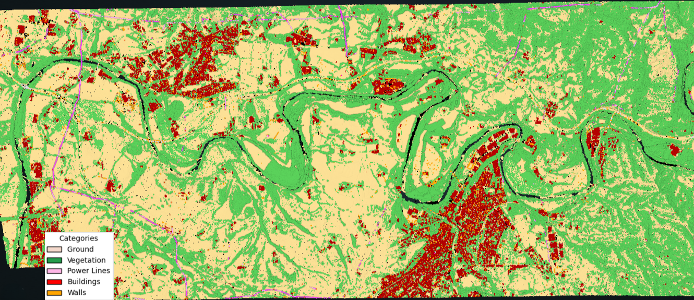
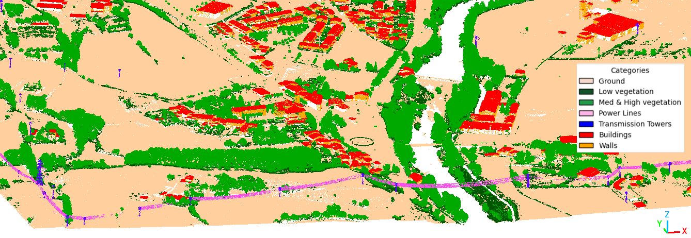

# LoRA for PointNet++ in Airborne LiDAR Semantic Segmentation

> Parameter‑efficient fine‑tuning (LoRA) for 3D point cloud semantic segmentation with PointNet++, evaluated on airborne LiDAR datasets.

[](#license)
[]()
[]()

## 💡 Overview
This repository contains code and assets accompanying the paper:
> **Efficient Task and Domain Adaptation in ALS Semantic Segmentation via LoRA for PointNet++**  
Semantic segmentation of airborne LiDAR point clouds enables a broad range of urban and environmental applications. However, domain shifts between training and operational data, as well as the frequent emergence of new semantic classes, pose significant challenges for deploying deep learning models effectively. In this work, we explore the integration of Low-Rank Adaptation (LoRA), a parameter-efficient fine-tuning technique, into the PointNet++ architecture to address these challenges. We evaluate LoRA in two realistic scenarios: domain adaptation and incremental learning with novel classes, using large-scale LiDAR datasets. Our experiments demonstrate that LoRA achieves superior performance compared to traditional full fine-tuning, showing greater resistance to catastrophic forgetting and improved generalization, particularly for underrepresented classes. Furthermore, LoRA maintains or exceeds baseline accuracy with substantially fewer trainable parameters, highlighting its suitability for resource-constrained deployment scenarios. We also present TerLiDAR, a publicly available annotated airborne LiDAR dataset, to support further research in domain adaptation for remote sensing.

<p align="center">
  
</p>
<p align="left">
  <em>
PN++ architecture. Set Abstraction (SA) layers sample input points, group them, and apply PointNet to obtain high-dimensional representations. Feature Propagation (FP) layers upsample points and propagate features back to the original resolution.
 </em>
</p>

### LoRA applied to PointNet++
<p align="center">
  
</p>
<p align="left">
  <em>
    Orange boxes indicate trainable modules.  
    The input point cloud is represented as x ∈ ℝ<sup>N×D</sup>, where N is the number of input points and D is the number of input features.  
    Each layer processes local neighborhoods, where N<sub>l</sub> is the number of sampled points at each level l, K is the number of neighboring points in the local region, and D<sub>in</sub> and D<sub>out</sub> are the input and output feature dimensions.  
    The output of the network is a per-point semantic prediction y ∈ ℝ<sup>N×C</sup>, where C is the number of semantic classes.
  </em>
</p>

## ✨ Key Contributions
- **LoRA-enabled PointNet++**: Integration of Low-Rank Adaptation modules into the PointNet++ architecture to enable parameter-efficient fine-tuning.
- **Task & domain adaptation**: Evaluation across different airborne LiDAR datasets and in class extension scenarios, demonstrating LoRA's flexibility with minimal parameter overhead.
- **TerLiDAR dataset**: We release **TerLiDAR**, an open, annotated airborne LiDAR dataset covering 51.4 km² of mixed urban and forested landscapes along the Ter River in Catalonia, Spain.  

> 📄 **Paper link**: Will be released here as soon as the paper is published.


### TerLiDAR Dataset
<p align="center">
  
</p>
<p align="center">
  <em>
    Geographic coverage of the TerLiDAR dataset along the Ter River in Catalonia, Spain.  
  </em>
</p>

We present TerLiDAR, a fully open and annotated airborne LiDAR dataset that covers 51.4~km\textsuperscript{2} of urban and forested areas along the Ter River in Catalonia, Spain. The data were acquired in July 2021 using an ALS system mounted on a georeferenced aircraft operated by ICGC. The dataset comprises 692 million colorized 3D points, each annotated with one of the semantic classes listed in the paper.

<p align="center">
  
  
</p>
<p align="center">
  <em>
    Visualization of a LAS tile using RGB values and corresponding semantic classes.
  </em>
</p>


## 📦 Environment
- Python 3.9+
- PyTorch 1.12+ with CUDA 11.x (recommended)

Quick setup:
```bash
conda create -n lora-pn2 python=3.10 -y
conda activate lora-pn2
pip install -r requirements.txt
